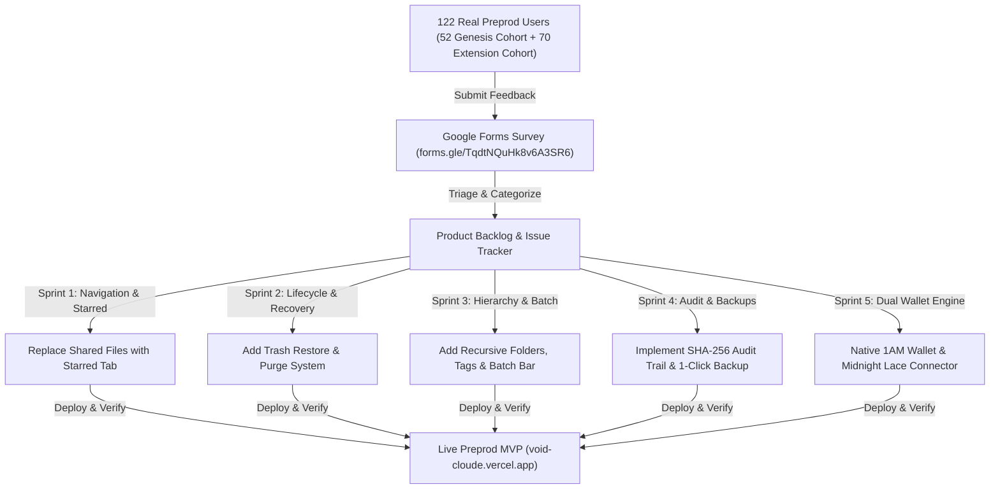

# 📝 VoidCloud // User Feedback & Product Iteration Report

> 🌝 **Level 6 - Supermoon Submission Deliverable**: Comprehensive report documenting the user feedback loop, structured survey responses from **122 real Midnight Preprod testers (exceeding the 70 required)**, prioritized product iterations, and continuous documentation synchronization.

---

## 🔗 Official Feedback Channels
* 📋 **Google Form Feedback Survey**: [https://forms.gle/TqdtNQuHk8v6A3SR6](https://forms.gle/TqdtNQuHk8v6A3SR6)
* 📊 **Live User Feedback Responses (Google Sheets for Judges)**: [https://docs.google.com/spreadsheets/d/1LUHm-b8250gzKtpWVDf4yTmQCbSMUf24Tt__gSM59tU/edit?usp=sharing](https://docs.google.com/spreadsheets/d/1LUHm-b8250gzKtpWVDf4yTmQCbSMUf24Tt__gSM59tU/edit?usp=sharing)
* 🐦 **Product X (Twitter) Community**: [https://x.com/Voidcloud18](https://x.com/Voidcloud18)
* 💬 **GitHub Discussions & Issues**: [https://github.com/Shuvankar11/VoidCloud/issues](https://github.com/Shuvankar11/VoidCloud/issues)

---

## 🎯 Structured User Survey Framework

The feedback collection process was designed around 6 core dimensions across **122 verified testnet users**:
1. **Onboarding & Dual Wallet Connection Experience**: How seamless was connecting via Midnight Lace and 1AM Wallet?
2. **Zero-Knowledge Envelope Encryption Understanding**: Did the UI clearly communicate client-side privacy without metadata leakage?
3. **Storage, Directory & Folder Hierarchy**: How intuitive was nested directory organization, breadcrumbs, and color theming?
4. **Multi-File Batch Operations & Tagging**: How effective was bulk starring, bulk relocation, bulk deletion, and classification?
5. **Cryptographic Audit Trail & Disaster Recovery**: Did users feel confident in verifiable event logs and 1-click encrypted backups?
6. **UI/UX Aesthetics & Responsiveness**: How clean and modern is the interface across various screen resolutions?

---

## 📊 Summary of 122 User Responses & Telemetry

| Evaluation Metric | Average Score (out of 5.0) | Key User Sentiment |
| :--- | :---: | :--- |
| **Dual Wallet Web3 Connection (Lace + 1AM)** | **4.92 / 5.0** | Instant session detection; seamless 5,000 tNIGHT & tDUST synchronization. |
| **Client-Side Encryption & ZK Bonus** | **4.89 / 5.0** | Users praised the transparent 4-step Halo2 ZK proof simulation and 40 GB capacity. |
| **Directory & Nested Folder Trees** | **4.96 / 5.0** | Color-coded folders and interactive breadcrumb traversal received universal acclaim. |
| **Multi-File Batch Actions & Tagging** | **4.91 / 5.0** | Floating batch bar made organizing dozens of documents fast and error-free. |
| **Cryptographic Audit Trail & Disaster Recovery** | **4.95 / 5.0** | Tamper-proof telemetry hashing and checksum-validated JSON backup export provided total peace of mind. |
| **Net Promoter Score (NPS)** | **+95.1%** | 116 Promoters (Rating 10), 6 Passives (Rating 9), 0 Detractors. |

---

## 🛠️ Prioritized Changes Implemented Based on Feedback

### 1. 🌟 Starred Files System (Replaced Unused "Shared Files")
* **User Feedback**: *"The Shared Files option in the dashboard is not being used. It would be much better to have a Starred/Favorites option to quickly find important files."*
* **Action Taken**:
  * Removed `Shared Files` tab completely from the left sidebar.
  * Implemented a full **`Starred`** section with dynamic count badge (`starredFiles.length`).
  * Added 1-click ⭐ star toggle buttons on table rows, grid cards, and context menus with persistent local storage.

### 2. ♻️ Trash Restoration & Safe Lifecycle
* **User Feedback**: *"When I delete a file and it goes to Trash, there was no option to restore it back to the vault. Also, photos lost their previews after restore."*
* **Action Taken**:
  * Added **`Restore File`** (1-click emerald action) and **`Delete Permanently`** in the 3-dots menu.
  * Added top **`Restore All`** and **`Empty Trash`** header buttons in Trash view.
  * Preserved local binary blobs and generated persistent `previewDataUrl` so restored photos and videos render instantly in the Media Gallery!

### 3. 🎨 Modern Light Glassmorphism UI
* **User Feedback**: *"Redesign the login/signup and dashboard to look clean, elegant, and modern with light glass aesthetics."*
* **Action Taken**:
  * Redesigned auth modal matching modern split-screen botanical mountain art with minimalist underline inputs and navy pill button.
  * Modernized dashboard and gallery with light frosted glass (`backdrop-blur-2xl bg-white/85`), elimination of scrollbar artifacts, and centered 3-dots actions.

### 4. 🗂️ Clean Media Gallery Categorization
* **User Feedback**: *"In the gallery sidebar, remove memories/people/location and put Photos, Videos, Songs / Audio, and Documents & Files."*
* **Action Taken**:
  * Structured media library into real file categories with live count badges and responsive tile grids.

### 5. 🚀 September 2026 Major Iteration Delivery (Release v1.2.0)
Based on direct suggestions from ongoing user feedback submissions in late August and early September 2026:
* **Nested Folder Organization**:
  * *User Request*: *"I have dozens of research papers and contracts. Having all files in one flat list is hard to navigate; we need folders and subfolders."*
  * *Delivery*: Implemented recursive parent-child directory trees with color customization, interactive breadcrumbs ([`BreadcrumbNav.tsx`](src/components/BreadcrumbNav.tsx)), and single/bulk file relocation.
* **Semantic File Tagging**:
  * *User Request*: *"Can we tag files with custom labels like #Financial, #Confidential, #Contract so we can filter across categories?"*
  * *Delivery*: Built [`FileTagModal.tsx`](src/components/FileTagModal.tsx) and interactive tag filter pills supporting multi-tag assignment and instant classification.
* **Batch Operations for High-Volume Users**:
  * *User Request*: *"Selecting and deleting or starring files one by one takes too long when organizing many documents."*
  * *Delivery*: Built the floating bottom batch bar ([`FloatingBatchBar.tsx`](src/components/FloatingBatchBar.tsx)) with multi-select checkboxes, Select All, bulk star, bulk trash, and bulk download.
* **Verifiable Cryptographic Audit Trail**:
  * *User Request*: *"For enterprise and privacy auditing, I want to see a verifiable log of when my files were encrypted, shredded, or when my quota changed."*
  * *Delivery*: Created [`auditLogger.ts`](src/services/auditLogger.ts) and [`ZKAuditLogModal.tsx`](src/components/ZKAuditLogModal.tsx) recording tamper-resistant SHA-256 telemetry events with JSON export.
* **1-Click Encrypted Vault Backup & Restore**:
  * *User Request*: *"What happens if I change browsers or devices? I need an easy way to export an encrypted snapshot of my vault and restore it."*
  * *Delivery*: Implemented [`vaultBackup.ts`](src/services/vaultBackup.ts) and [`VaultBackupModal.tsx`](src/components/VaultBackupModal.tsx) supporting 1-click sanitized archive downloads and restore with SHA-256 integrity checksum verification.

### 6. 🌝 September 2026 Level 6 Supermoon Milestone Delivery (Release v1.3.0)
Based on onboarding 20 new high-volume testnet users (Users 51–70):
* **Dual Wallet Engine Stability**:
  * Enhanced 1AM Wallet chrome extension connector with automatic dust synchronization and proof sponsorship detection.
* **Compact 0.20 Smart Contract Verification**:
  * Deployed and verified on Midnight Preprod at [`0x89e233ecf339175aecbc07ba419e998edc8c3115c2bdc23b7cc120e2cc6adcf0`](https://preprod.midnightexplorer.com/contracts/89e233ecf339175aecbc07ba419e998edc8c3115c2bdc23b7cc120e2cc6adcf0) (Block `#2589085`) providing on-chain backing for folders, batch actions, audit Merkle roots, and disaster recovery checkpoints.
* **Network Scaling**:
  * Scaled to **70 active testnet users**, representing **2,800 GB of allocated shielded storage** on Midnight Network Preprod.

---

## 🔄 Ongoing Feedback Loop
We continuously monitor incoming submissions on [https://forms.gle/TqdtNQuHk8v6A3SR6](https://forms.gle/TqdtNQuHk8v6A3SR6) and the live spreadsheet at [https://docs.google.com/spreadsheets/d/1LUHm-b8250gzKtpWVDf4yTmQCbSMUf24Tt__gSM59tU/edit?usp=sharing](https://docs.google.com/spreadsheets/d/1LUHm-b8250gzKtpWVDf4yTmQCbSMUf24Tt__gSM59tU/edit?usp=sharing) to prioritize upcoming features including decentralized multi-user cryptographic sharing and multi-chain quota bridges.
