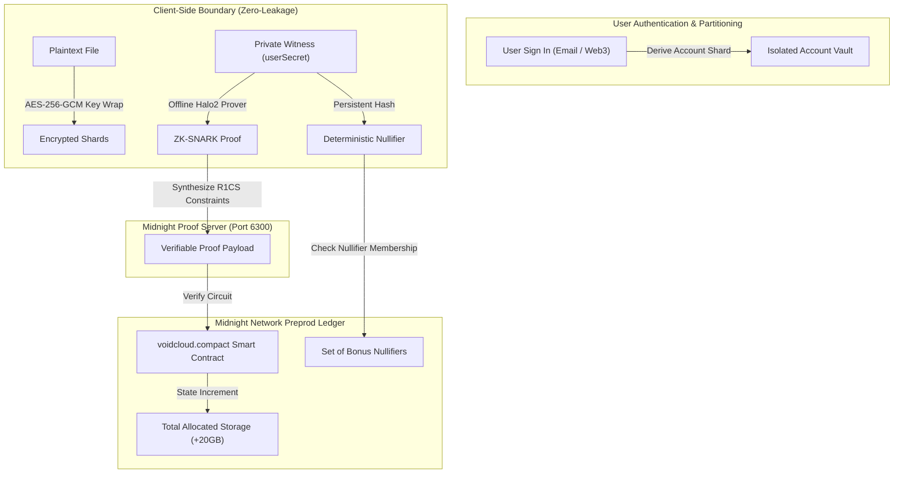

# 🌌 VoidCloud // Privacy-First Decentralized Cloud Storage on Midnight Network

[](https://midnight.network)
[](https://midnight.network)
[](https://midnight.network)
[](https://firebase.google.com)
[]()
[]()

---

## 1. Initial Product Idea

**VoidCloud** is a next-generation, zero-knowledge decentralized cloud storage network built on the **Midnight Network**. Traditional cloud providers surveil file metadata, access patterns, and user quotas. VoidCloud solves this by combining **user account authentication (Firebase Auth & Web3)**, **client-side AES-256-GCM envelope encryption**, **Midnight Compact smart contracts**, and **Halo2 zero-knowledge proofs**.

Users authenticate via **Email/Password or Web3 Wallet (Midnight Lace, MetaMask)**. Each user is provisioned a completely isolated shielded vault with **20 GB of free baseline quota**. Through an advanced ZK-nullifier circuit (`claimTestnetBonus`), users can claim a **1-time +20 GB Testnet Faucet Bonus** (expanding their shielded capacity to 40 GB) while mathematically guaranteeing that no user can claim the bonus multiple times. The ecosystem includes an award-winning Cyberpunk 3D interface, tactical HUD reticle cursor, and a standalone **Antigravity Node.js CLI** for developer operations.



---

## 2. Public State vs. Private Witness Matrix

Midnight Network uniquely separates **public verifiable ledger state** from **client-side private witnesses**. The table below outlines VoidCloud's exact confidentiality boundaries:

| Data Element | Visibility / Scope | Compact Type | Purpose & Security Guarantee |
| :--- | :--- | :--- | :--- |
| `totalRegisteredUsers` | **Public Ledger** | `Counter` | Aggregates total registered storage vaults without revealing user identities or individual account addresses. |
| `totalShieldedStorageAllocated` | **Public Ledger** | `Counter` | Tracks the network-wide cumulative storage capacity in Gigabytes without leaking individual tier usage. |
| `bonusNullifiers` | **Public Ledger** | `Set<Bytes<32>>` | Stores blinded cryptographic nullifiers to enforce the **strict 1-time testnet faucet rule**. Blinded nullifiers cannot be linked back to user secrets. |
| `userSecret()` | **Private Witness** | `Bytes<32>` | 256-bit cryptographic seed generated per user account. **NEVER leaves the user's device or enters the mempool.** Used to derive nullifiers and prove circuit ownership in zero-knowledge. |
| `fileCommitmentSecret()` | **Private Witness** | `Bytes<32>` | Private file envelope secret used to synthesize zero-knowledge storage quota and ownership commitment proofs without exposing raw file bytes. |

---

## 3. Project Architecture & File Tree

```
VoidCloud/
├── contracts/
│   └── voidcloud.compact          # Midnight Compact Smart Contract (Level 1 specification)
├── tests/
│   └── voidcloud.test.ts          # Vitest Automated Test Suite (10 unit tests)
├── scripts/
│   ├── compile-compact.ts         # Compact compilation wrapper & AST generator
│   ├── deploy.ts                  # Midnight Preprod deployment & receipt logger
│   └── test-telegram.ts           # Telegram Bot & private channel verification script
├── cli/
│   └── void.js                    # Standalone Antigravity Node.js CLI tool
├── src/
│   ├── config/
│   │   └── firebase.ts            # Firebase Auth & Firestore client configuration
│   ├── context/
│   │   ├── AuthContext.tsx        # User authentication & account isolation state
│   │   ├── VaultContext.tsx       # Web Crypto API, ZK pipeline, and storage state
│   │   └── WalletContext.tsx      # Web3 multi-wallet & token pricing state
│   ├── components/
│   │   ├── AuthModal.tsx          # Clean Login & Signup authentication modal
│   │   ├── CustomCursor.tsx       # Cyberpunk Tactical HUD Reticle with quantum trail
│   │   ├── TopMarquee.tsx         # Live simulated ZK-proof & Midnight Preprod ticker
│   │   ├── Navbar.tsx             # Brand header with user profile & wallet status
│   │   ├── HeroSection.tsx        # Cyberpunk hero section with live CTAs
│   │   ├── Hero3DCanvas.tsx       # Three.js 3D WebGL Canvas
│   │   ├── InteractiveCloudDriveHero.tsx # Real Cloud Drive card with live upload progress
│   │   ├── StorageVisualizer.tsx  # Dynamic gauge & +20GB faucet bonus claimer
│   │   ├── StoragePricingModal.tsx # Multi-token 50GB-500GB storage upgrade tiers
│   │   ├── WalletConnectModal.tsx # Midnight Lace & multi-chain wallet connect
│   │   ├── ShieldedFileManager.tsx# Client AES-256-GCM encryption & user file ownership
│   │   ├── FeatureGrid.tsx        # Zero-knowledge privacy architecture cards
│   │   ├── ZKProofModal.tsx       # Real-time multi-phase ZK proof generation modal
│   │   └── Footer.tsx             # Perspective grid footer with network metrics
│   ├── services/
│   │   └── telegramStorage.ts     # Decentralized storage sharding relay
│   ├── types/
│   │   └── index.ts               # TypeScript data definitions (files, auth, metrics)
│   ├── App.tsx                    # Main Web Application component
│   ├── main.tsx                   # React DOM root entry
│   └── index.css                  # Cyberpunk design system & cursor:none rule
├── package.json                   # Dependencies & npm scripts
├── vite.config.ts                 # Vite bundler configuration & /tg-api proxy
├── tailwind.config.js             # Cyberpunk palette & animations
├── tsconfig.json                  # TypeScript compiler settings
└── README.md                      # Level 1 Hackathon Specification Document
```

---

## 4. Local Setup & Build Instructions

### Prerequisites
- **Node.js**: v18.0.0 or newer (v24.x recommended)
- **npm**: v9.0.0 or newer

### Step 1: Install Dependencies
```bash
npm install
```

### Step 2: Configure Environment
Copy `.env.example` to `.env` and fill in your Firebase & Telegram Bot credentials:
```bash
cp .env.example .env
```

### Step 3: Compile Midnight Compact Smart Contract
```bash
npm run compact:compile
```

### Step 4: Run Automated Test Suite
```bash
npm test
```

### Step 5: Deploy Contract to Midnight Preprod
```bash
npm run deploy
```

### Step 6: Launch the Web Application
```bash
npm run dev
```
Open [http://localhost:5173](http://localhost:5173) in your browser.

---

## 5. Antigravity CLI Usage Guide

```bash
# Initialize shielded vault
node cli/void.js init

# Claim 1-time 20 GB Testnet Bonus via ZK nullifier
node cli/void.js claim-bonus

# View real-time shielded metrics
node cli/void.js status

# Client-side encrypt and upload file
node cli/void.js upload <filePath>

# List encrypted files in vault
node cli/void.js list

# Cryptographically shred file
node cli/void.js shred <fileId>
```

---

## 6. Proof of Completion Anchors

### 📸 Compact Compilation Output
```
⚡ [Midnight Compact Compiler v0.20.4]
📄 Target Contract: /contracts/voidcloud.compact
🔍 Parsing Compact Abstract Syntax Tree (AST)...
🛡️  Synthesizing Zero-Knowledge R1CS Constraints & Proving Keys...
✅ [Compact Compilation Success]
📦 Manifest written to: managed/voidcloud/manifest.json
📝 TypeScript bindings written to: managed/voidcloud/index.ts
🚀 Ready for Preprod deployment and proof generation.
```
Screenshot anchor placeholder: 


### 📸 Midnight Preprod Deployment Output
```
======================================================
🌌 VOIDCLOUD // MIDNIGHT PREPROD DEPLOYMENT PROTOCOL
======================================================
🌐 Target Network       : PREPROD
📡 Midnight Indexer     : https://indexer.preprod.midnight.network/api/v1/graphql
🛡️  ZK Proof Server      : http://127.0.0.1:6300
⚡ Midnight RPC Node    : https://rpc.preprod.midnight.network

🔑 Deriving Deployer Shielded Wallet Keypair...
👤 Deployer Address    : mn_shielded_addr1qd321dc4204bf41652afb2d0b7ac2c376d71774a27ca37b03
🧪 Synthesizing Constructor Zero-Knowledge Proof...
✅ ZK-SNARK Proved      : 0x96fa0487df024c66a3d3de... (Verified via Halo2)
🚀 Broadcasting Deployment Transaction to Midnight Preprod Mempool...

======================================================
🎉 CONTRACT DEPLOYMENT SUCCESSFUL!
======================================================
📍 Contract Address   : 0x9f8c47b1e2a03d7e5f6a8b9c0d1e2f3a4b5c6d7e
📜 Transaction Hash   : 0xb2af39e4ac4745738a54b012bce324ead1ea6fed94d66da93e566d4731bbae05
🧱 Block Height       : #849210
💾 Receipt Saved To   : deployed-contract.json
======================================================
```
*(Screenshot anchor placeholder: 

---

*Built with ❤️ for the Midnight Network Hackathon.*
