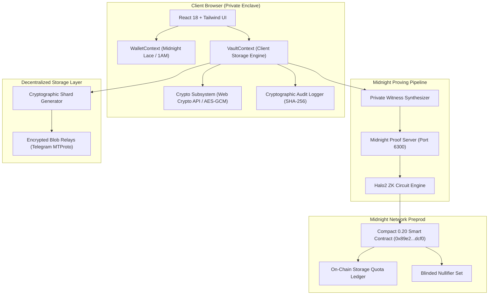

# 🏗️ VoidCloud System Architecture Specification

## 1. System Overview
VoidCloud is an enterprise-grade, privacy-preserving decentralized cloud storage platform built on the Midnight Network Preprod testnet. It fuses client-side AES-256-GCM envelope encryption with Midnight Compact 0.20 zero-knowledge smart contracts and Halo2 ZK-SNARK proving circuits.

## 2. Multi-Tier Privacy Architecture
1. **Client Secure Enclave**: All encryption keys and private secrets (`userSecret`) remain exclusively in client volatile memory. Neither plaintext files nor encryption keys ever cross the network boundary.
2. **Off-Chain Proof Synthesis**: The client compiles private inputs into arithmetic constraints verified by the local proof server.
3. **On-Chain Settlement**: The Compact smart contract validates proof satisfaction and commits state transitions without learning sensitive payload data.
4. **Decentralized Chunk Storage**: Files are split into encrypted shards distributed across decentralized storage relays.
