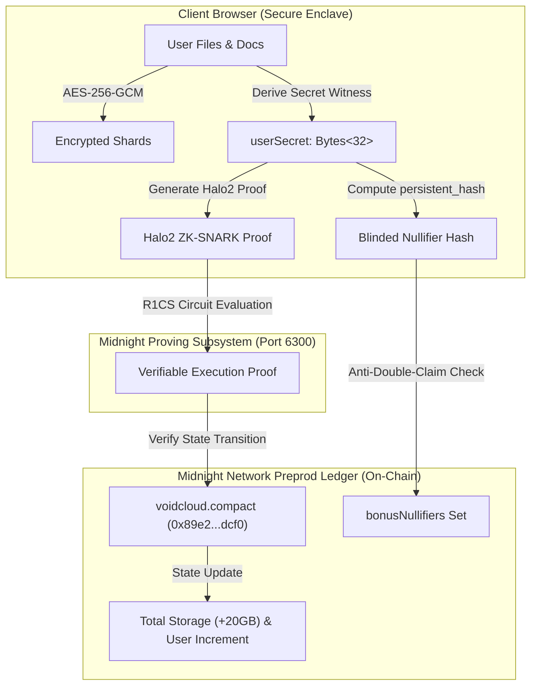

# 💡 VoidCloud Product Proposal & Technical Specification

> 🏆 **Rise In Monthly Moonshots on Midnight Hackathon Deliverable**  
> **Category**: Decentralized Cloud Storage & Privacy-Preserving Infrastructure  
> **Target Network**: Midnight Network Preprod (Testnet)  
> **Status**: Approved & Live on Preprod (Level 6 Supermoon Milestone)

---

## 1. Executive Summary & Problem Statement

### The Problem
Traditional centralized cloud storage providers (Google Drive, Dropbox, AWS S3, Microsoft OneDrive) have fundamental structural flaws:
1. **Centralized Root Key Access**: Cloud operators hold master decryption keys and can inspect, scan, and monetize stored files.
2. **Metadata & Behavioral Surveillance**: Access timestamps, IP addresses, folder structures, and file sizes are continuously tracked and logged.
3. **Single Point of Failure / Censorship**: Files can be arbitrarily deleted, accounts suspended, or data seized without due process.

### The VoidCloud Solution
**VoidCloud** is an enterprise-grade, zero-knowledge decentralized cloud vault. By combining **client-side AES-256-GCM envelope encryption** with **Midnight Compact 0.20 smart contracts** and **Halo2 ZK-SNARK proofs**, VoidCloud guarantees:
* **Zero Metadata Leakage**: Plaintext file names, sizes, directory structures, and encryption keys never leave the client browser enclave.
* **Verifiable Capacity Rights**: Storage allocations and faucet bonuses are enforced on Midnight Preprod via zero-knowledge proofs without revealing user identity or witness secrets.
* **Non-Custodial Multi-Wallet Support**: Native integration with official **1AM Wallet** and **Midnight Lace** DApp connectors.

---

## 2. Product Architecture & Cryptographic Invariants

### Observer Privacy Boundary
| Data Domain | What an Observer CANNOT Learn (Private) 🔒 | What an Observer CAN Learn (Public) 👁️ |
| :--- | :--- | :--- |
| **User Identity** | • Private witness entropy (`userSecret`) • Wallet private keys & recovery seeds | • Shielded DApp account address • CIP-30 wallet connection status |
| **Stored Files** | • Raw file contents & document text • File names, mime types, and original metadata • File encryption symmetric keys (AES-256-GCM) | • File commitment hashes (`persistent_hash(secret)`) • Total shielded bytes counter (aggregated) |
| **Circuit Proofs** | • Secret input values used during proof synthesis • Intermediate R1CS constraint assignments | • Halo2 ZK-SNARK proof validity (`true` / `false`) • Blinded nullifier hash (`Set.insert`) |

---

## 3. Product Features (Level 6 Supermoon MVP)

1. **Client-Side Envelope Encryption**: AES-256-GCM file encryption in browser RAM.
2. **Recursive Folder Hierarchy**: Unlimited parent-child nesting with visual color themes.
3. **Semantic File Tagging**: Color-coded categorization with dynamic filter pills.
4. **Floating Batch Operations Bar**: Multi-file select, bulk star, bulk trash, and bulk download.
5. **Zero-Knowledge Cryptographic Audit Trail**: Tamper-resistant SHA-256 hash chains for all vault events.
6. **1-Click Encrypted Vault Backup & Disaster Recovery**: Sanitized JSON archive export/import with SHA-256 checksum verification.
7. **Dual Web3 Wallet Support**: Native connector for 1AM Wallet and Midnight Lace with live balance sync (tNIGHT, tDUST, ADA).
8. **Compact 0.20 Smart Contract**: On-chain storage quota ledger and double-claim defense deployed on Midnight Preprod.

---

## 4. Market Opportunity & Target Audience

* **Privacy-Conscious Individuals**: Journalistic sources, activists, and high-net-worth individuals requiring uncompromised file privacy.
* **Web3 Developers & Protocols**: Safe storage of deployment seeds, private keys, smart contract specifications, and audits.
* **Decentralized Autonomous Organizations (DAOs)**: Archival of governance records, voting manifests, and treasury allocations with verifiable provenance.
* **Enterprise Legal & Healthcare**: Compliance with GDPR, HIPAA, and CCPA through mathematical zero-leakage guarantees.

---

## 5. Tokenomics & Storage Plans

| Storage Tier | Capacity | Testnet Price | Target Mainnet Price | Features Included |
| :--- | :---: | :---: | :---: | :--- |
| **Standard Shielded** | 40 GB | **FREE (Testnet Faucet)** | Free (5 GB) | Client AES-256-GCM, ZK Nullifier defense, Web3 wallet sync |
| **Developer Pro** | 100 GB | 500 tNIGHT | $4.99 / mo | Recursive folder nesting, batch bar, audit trail export |
| **Enterprise ZK Vault** | 500 GB | 2,000 tNIGHT | $19.99 / mo | Priority proving relay, disaster recovery backup, dedicated shards |

---

## 6. Official Resources & Verification Anchors

* 🌐 **Live Production dApp**: [https://voidcloud.bbroot.com/](https://voidcloud.bbroot.com/) (Mirror: [https://void-cloude.vercel.app/](https://void-cloude.vercel.app/))
* 📜 **Deployed Midnight Preprod Contract**: [`0x89e233ecf339175aecbc07ba419e998edc8c3115c2bdc23b7cc120e2cc6adcf0`](https://preprod.midnightexplorer.com/contracts/89e233ecf339175aecbc07ba419e998edc8c3115c2bdc23b7cc120e2cc6adcf0) (Block `#2589085`)
* 👥 **Launch Users Registry**: [`LAUNCH_USERS.md`](LAUNCH_USERS.md) (122 Verified Preprod Users)
* 📊 **Tester Feedback Ledger**: [`FEEDBACK.md`](FEEDBACK.md) & [Google Sheets](https://docs.google.com/spreadsheets/d/1LUHm-b8250gzKtpWVDf4yTmQCbSMUf24Tt__gSM59tU/edit?usp=sharing)
* 📦 **Public GitHub Repository**: [https://github.com/Shuvankar11/VoidCloud](https://github.com/Shuvankar11/VoidCloud)
