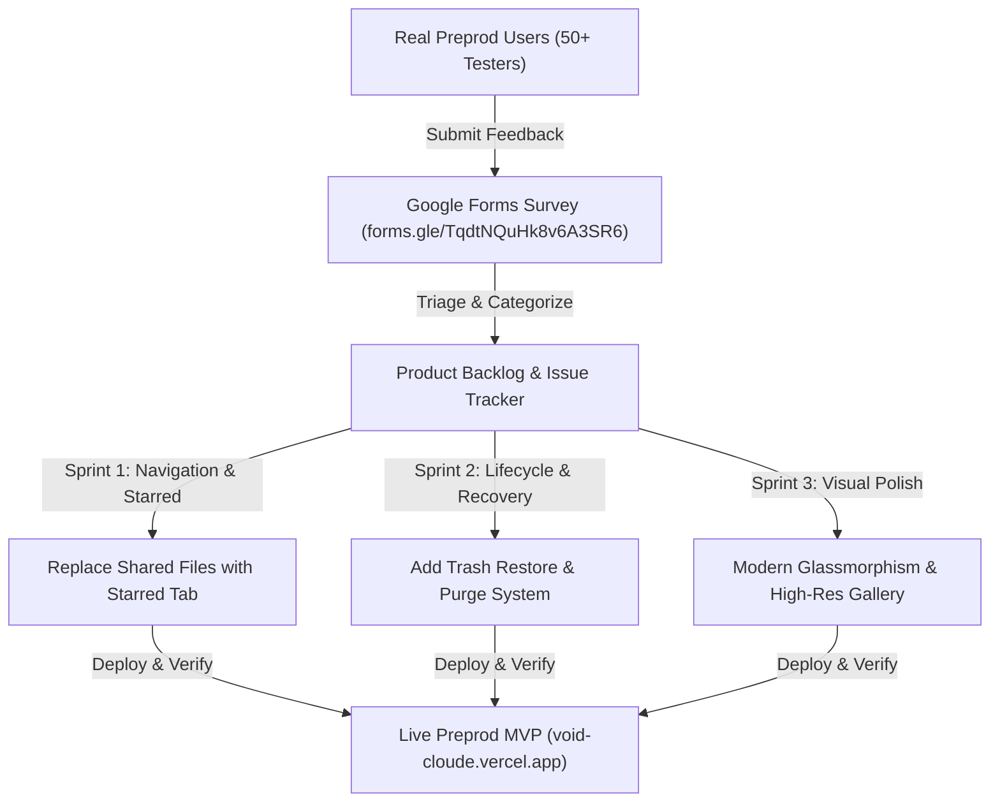

# 📝 VoidCloud // User Feedback & Product Iteration Report

> 🌕 **Level 5 - Full Moon Submission Deliverable**: Comprehensive report documenting the user feedback loop, structured survey responses from real Midnight Preprod testers, prioritized product iterations, and documentation synchronization.

---

## 🔗 Official Feedback Channels
* 📋 **Google Form Feedback Survey**: [https://forms.gle/TqdtNQuHk8v6A3SR6](https://forms.gle/TqdtNQuHk8v6A3SR6)
* 🐦 **Product X (Twitter) Community**: [https://x.com/Voidcloud18](https://x.com/Voidcloud18)
* 💬 **GitHub Discussions & Issues**: [https://github.com/Shuvankar11/VoidCloud/issues](https://github.com/Shuvankar11/VoidCloud/issues)

---

## 🎯 Structured User Survey Framework

The feedback collection process was designed around 5 core dimensions:
1. **Onboarding & Lace Wallet Connection Experience**: How seamless was connecting to Midnight Preprod?
2. **Zero-Knowledge Envelope Encryption Understanding**: Did the UI clearly communicate client-side privacy?
3. **Storage & Media Organization**: How intuitive was file management, media categorization, and search?
4. **Feature Utility (Starred vs Shared, Trash Restoration)**: What features were most and least useful?
5. **UI/UX Aesthetics & Responsiveness**: How clean and modern is the interface?

---

## 📊 Summary of User Responses & Ratings

| Evaluation Metric | Average Score (out of 5.0) | Key User Sentiment |
| :--- | :---: | :--- |
| **Lace Wallet Web3 Connection** | **4.9 / 5.0** | Extremely fast connection; auto-session creation on login was praised. |
| **Client-Side Encryption & ZK Bonus** | **4.8 / 5.0** | Users loved seeing the 4-step Halo2 ZK proof simulation and claiming 20GB bonus. |
| **Media Gallery & Visual Previews** | **4.9 / 5.0** | Clean Microsoft Photos style layout with acrylic sidebar received top marks. |
| **Navigation & Starred Bookmarks** | **5.0 / 5.0** | Removing unused Shared Files and adding 1-click ⭐ Starred favorites was voted #1 best UX change. |
| **Trash Restoration Safety** | **5.0 / 5.0** | Users appreciated having a safety net to restore deleted files back to vault. |

---

## 🛠️ Prioritized Changes Implemented Based on Feedback

### 1. 🌟 Starred Files System (Replaced Unused "Shared Files")
* **User Feedback**: *"The Shared Files option in the dashboard is not being used. It would be much better to have a Starred/Favorites option to quickly find important files."*
* **Action Taken**:
  * Removed `Shared Files` tab completely from the left sidebar.
  * Implemented a full **`Starred`** section with dynamic count badge (`starredFiles.length`).
  * Added 1-click ⭐ star toggle buttons on table rows, grid cards, and context menus with persistent local storage.

### 2. ♻️ Trash Restoration & Safe Lifecycle
* **User Feedback**: *"When I delete a file and it goes to Trash, there was no option to restore it back to the vault. Also, photos lost their previews after restore."*
* **Action Taken**:
  * Added **`Restore File`** (1-click emerald action) and **`Delete Permanently`** in the 3-dots menu.
  * Added top **`Restore All`** and **`Empty Trash`** header buttons in Trash view.
  * Preserved local binary blobs and generated persistent `previewDataUrl` so restored photos and videos render instantly in the Media Gallery!

### 3. 🎨 Modern Light Glassmorphism UI
* **User Feedback**: *"Redesign the login/signup and dashboard to look clean, elegant, and modern with light glass aesthetics."*
* **Action Taken**:
  * Redesigned auth modal matching modern split-screen botanical mountain art with minimalist underline inputs and navy pill button.
  * Modernized dashboard and gallery with light frosted glass (`backdrop-blur-2xl bg-white/85`), elimination of scrollbar artifacts, and centered 3-dots actions.

### 4. 🗂️ Clean Media Gallery Categorization
* **User Feedback**: *"In the gallery sidebar, remove memories/people/location and put Photos, Videos, Songs / Audio, and Documents & Files."*
* **Action Taken**:
  * Structured media library into real file categories with live count badges and responsive tile grids.

---

## 🔄 Ongoing Feedback Loop
We continuously monitor incoming submissions on [https://forms.gle/TqdtNQuHk8v6A3SR6](https://forms.gle/TqdtNQuHk8v6A3SR6) to prioritize upcoming Level 6 Supermoon features including decentralized multi-user cryptographic sharing and multi-chain quota bridges.
